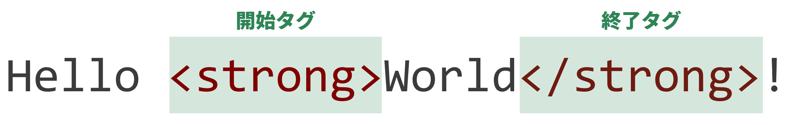
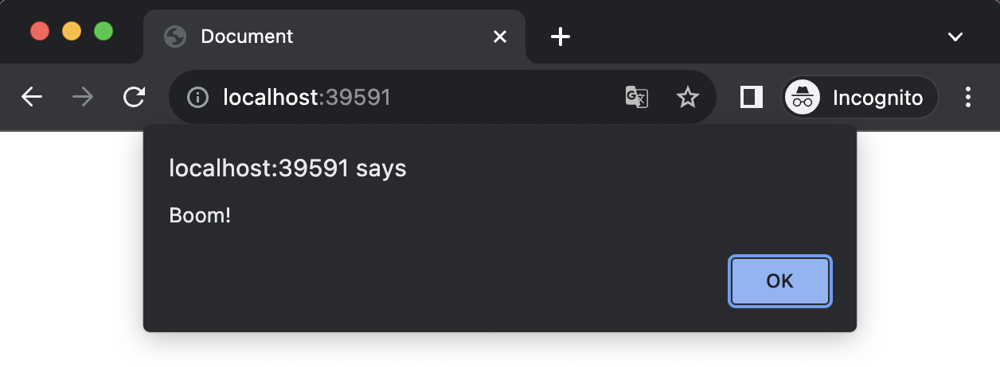

import InteractiveEditor from "@site/components/InteractiveEditor";

# ほかのユーザーを妨害しよう

Web サービスに対する攻撃は、データベースの中を覗こうとするものに限りません。
XSS は、Web が動作する仕組みを巧妙に悪用し、同じ Web サービスを使う別のユーザーを攻撃する手法です。

## ブラウザと HTML・JavaScript

パソコンやスマートフォンを用い、インターネットで調べ物をしているとき、あなたは何というアプリを使っていますか？
iPhone を使っている方は Safari を、Android を使っている方は Google Chrome を、Windows を使っている方は Microsoft Edge を使うことが多いのではないでしょうか。

Safari や Google Chrome のように、ウェブサイトを見るためのソフトウェアを**ブラウザ**と呼びます。
どのブラウザを使っても同じようにウェブサイトが動作するのは、このブラウザと呼ばれるソフトウェアの動作が、国際機関によって標準化されているためです。

これまで見てきたように、あなたがウェブサイトを見ようとしたとき、ブラウザはあなたの意思に応えて Web サーバーにウェブサイトのデータを送るよう要求します。

このとき、Web サーバーがブラウザに対して送り返すデータは、**HTML** や **JavaScript** といったプログラミング言語で記述されています。
ブラウザは、この HTML や JavaScript を解釈することにより、ウェブサイトを表示しています。



## HTML と JavaScript の基礎文法

ウェブサイトで使われる言語である HTML と JavaScript は、それぞれ次のような異なる役割を持ち、互いに協調して動作します。
それぞれの言語の書き方を見ていきましょう。

- HTML: ウェブサイトの構造を表現する
- JavaScript: HTML から参照され、ウェブサイトに動きを加える


### HTML

次の HTML は、画面に「Hello <strong>World</strong>」と表示するプログラムです。

<p>
  <InteractiveEditor
    html="Hello <strong>World</strong>"
  />
</p>

HTML における `<` から始まり `>` で終わる部分は、**タグ** と呼ばれます。
タグはそれぞれ固有の意味を持ち、 `<tag>内容</tag>` のように、タグ名の先頭にスラッシュを付けるか否かの区別により開始タグと終了タグに分かれ、内部にテキストや別のタグを挟み込むことができます。

上の例では、テキストの一部分を強調するための `<strong>` タグを使用しているため、`World` の部分が太字で表示されています。



HTML では、他にも多くのタグが定義されており、ウェブサイトの豊かな表現力を支えています。

<p>
  <InteractiveEditor
    html={`
<input>
<button>送信</button>
<h3>買い物リスト</h3>
<ul>
  <li>キャベツ</li>
  <li>にんじん</li>
</ul>
    `.trim()}
  />
</p>

### JavaScript

Web サイトに動きを与えるためのプログラミング言語である JavaScript は、通常 HTML の中に埋め込まれる形で記述されます。
次の例では、JavaScript を用いて「Hello World」の「World」の部分を出力しています。

<p>
  <InteractiveEditor
    html={`
Hello
<script>
  document.write("World");
</script>
    `.trim()}
  />
</p>

HTML の中で JavaScript を使用するためには、`script` タグを用います。
この例では、`document.write("World");` の部分が JavaScript になっており、このプログラムが実行されることで、`World` が出力されます。

## XSS

JavaScript は、ウェブブラウザ上でのリッチな表現を可能にしますが、意図しない JavaScript が実行されてしまうと、ウェブサイトの利用者に深刻な被害を与えてしまう可能性があります。

**XSS (クロスサイトスクリプティング)** は、攻撃者が、ウェブサイト製作者の意図しない方法により、別のウェブサイト利用者に強制的に JavaScript を実行させる攻撃手法です。

例として、投稿されたメッセージの一覧が表示されるシンプルな掲示板アプリを考えてみましょう。
この掲示板は、投稿されたメッセージをシンプルに箇条書きにして表示するとします。
箇条書きを表示することのできる HTML タグは、`ul` タグと `li` タグです。
次の HTML は、2 人の投稿者がそれぞれ「おはようございます」「こんにちは」と投稿した場合の HTML です。

<p>
  <InteractiveEditor
    html={`
<ul>
  <li>おはようございます</li>
  <li>こんにちは</li>
</ul>
    `.trim()}
  />
</p>

しかし、もし悪意のある投稿者が、`script` タグを含む投稿を行ったらどうなるでしょう。
サーバーは受け取った `script` タグを含む投稿を、そのまま他の掲示板利用者に送信してしまいます。
すると、他のすべての掲示板利用者のブラウザの上で、悪意のある投稿者が記述した任意の JavaScript が実行できてしまいます。



<p>
  <InteractiveEditor
    html={`
<ul>
  <li>おはようございます</li>
  <li>こんにちは</li>
  <li><script>document.write("Boom!");</script></li>
</ul>
    `.trim()}
  />
</p>

上の例では、攻撃者は `script` タグの中で `document.write` を記述しています。
このプログラムが実行されることで、`Boom!` が表示されています。
このような単純な例であれば、他の掲示板利用者に大きな影響はありません。
しかし、JavaScript には、悪用されると非常に危険な機能が多く定義されています。

### メッセージボックスの表示

```html
<script>
  alert("Boom!");
</script>
```

`alert("メッセージ")` のように記述すると、画面上にメッセージボックスが表示されます。
この機能は、通常はウェブサイトからの通知を表示させるために用いられますが、攻撃者は、ウェブサイトからの通知に偽装して、被害者を危険な行動に導くことができます。



### リダイレクト

```html
<script>
  location.href = "https://example.com/";
</script>
```

`location.href = "URL";` のように記述すると、ブラウザで任意のページを強制的に開かせることができます。
この機能を悪用し、攻撃者は自身が用意した偽のウェブサイトにアクセスさせることで、被害者から個人情報などを盗み出すことができます。


