# 基本の論理回路

## Not回路
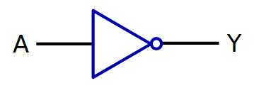

Not回路とは次のような記号で表される回路で、インプット側のAを0にするとアウトプット側のYが1に、反対にAを1にするとYが0となるような動作をします。

これを表にしてみると、以下のようになります。

| A | Y |
| - | - |
| 1 | 0 |
| 0 | 1 |

この表のことを真理値表と言います。それでは実際にNot回路の動作を見てみましょう。[CreateCPU](https://create-cpu.pages.dev/)を開いて下さい。

画面右側に置かれているこの論理素子がCreateCPUでのNot回路です。

画面右下のボタンを押して下さい。そうすると、シミュレーションモードになります。

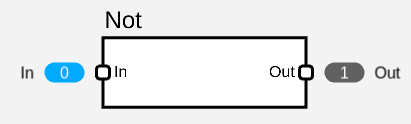

この状態では、Inに0が入力されるとOutで1が出力されています。Inの隣にある青いタグを押すと、入力の0と1を切り替えることが出来ます。押してみましょう。

想定通りの動作が確認出来ましたか？それでは、次の論理回路へと進みましょう。

## And回路
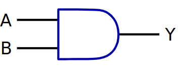

次はAnd回路です。And回路は、日本語で言う「かつ」を表すための回路で、AとBがともに1であるときにYが1となります。真理値表で表してみましょう。

| A | B | Y |
| - | - | - |
| 0 | 0 | 0 |
| 0 | 1 | 0 |
| 1 | 0 | 0 |
| 1 | 1 | 1 |

Andは論理和とも呼ばれます。

CreateCPUの画面左側に置かれているこの論理素子がAnd回路です。

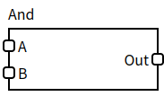

これも、動作確認をしてみましょう。

## Or回路
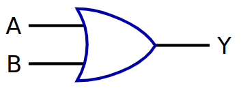

Or回路は、日本語で言う「または」を表す回路なのですが、ここで一点注意が必要です。日常会話では「AまたはB」というと、AとBのどちらか一方が成り立つというニュアンスとなりますが、論理回路では、AとBがともに1のときもYが1となります。真理値表は次の通りです。

| A | B | Y |
| - | - | - |
| 0 | 0 | 0 |
| 0 | 1 | 1 |
| 1 | 0 | 1 |
| 1 | 1 | 1 |

Orは論理積とも呼ばれます。

Or回路はまだCreateCPUの画面上に置かれていませんので、左側にあるこのOr回路を右にドラッグして、置いてみましょう。

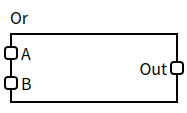

置けましたか？そうしたら、And回路と同様に動作確認をしてみましょう。

## Xor回路
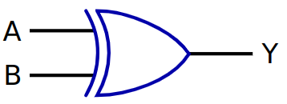

最後に紹介するのはXor回路です。Xorは排他的論理和とも言われます。これは、AまたはBのどちらか一方のみが1のときに、Yが1となる回路です。真理値表は以下の通りです。

| A | B | Y |
| - | - | - |
| 0 | 0 | 0 |
| 0 | 1 | 1 |
| 1 | 0 | 1 |
| 1 | 1 | 0 |

Xor回路は、CreateCPUでは次のような記号で表されています。

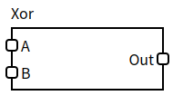

## 論理回路の完全性
実は、Not回路とAnd回路、あるいはNot回路とOr回路のみで、あらゆる組み合わせ回路(入力信号のみで出力が決定できる回路)を作ることが出来ます。実際に、Not回路とAnd回路を用いてOr回路を作ってみましょう。

次のようにNot回路とAnd回路を配置してましょう。

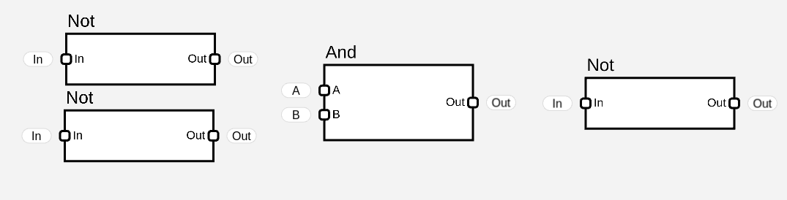

そうしたら、次のように配線をしてみましょう。

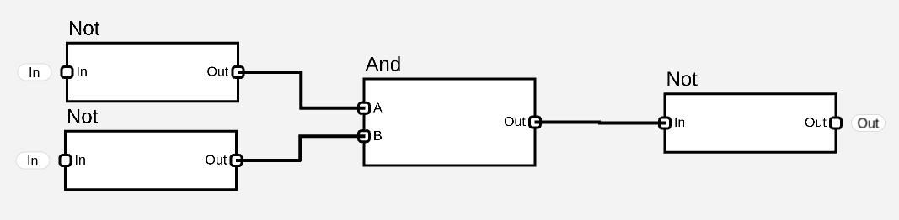

出来ましたか？シミュレーションモードで本当にOrと同じ動作をするか確認してみましょう。

次に、AndとOrとNotを用いて、Xor回路を作ってみましょう。

先程紹介したXor回路の動作を、より具体的に表現してみます。Xor回路はどのようなときに出力Yが1になる回路でしょうか？

Xor回路は、Aが0かつBが1、またはAが1かつBが0の時に出力Yが1となる回路、ということが出来ます。

ここで、「かつ」はAnd回路で、「または」はOr回路で表せることを思い出して下さい。さらに、Aが0である、というのはnot Aが1である、と言い換えることが出来ます。これらをすべて合わせると、Xor回路はnot Aが1かつBが1、またはAが1かつnot B が1の時に出力Yが1となる回路、と言い換えることが出来ます。

それでは、これを実際にAnd、Not、Orを用いた回路にしてみましょう。一つの入力を複数の箇所で使いたい場合はInputを使って下さい。

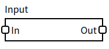

実際には以下のようになります。

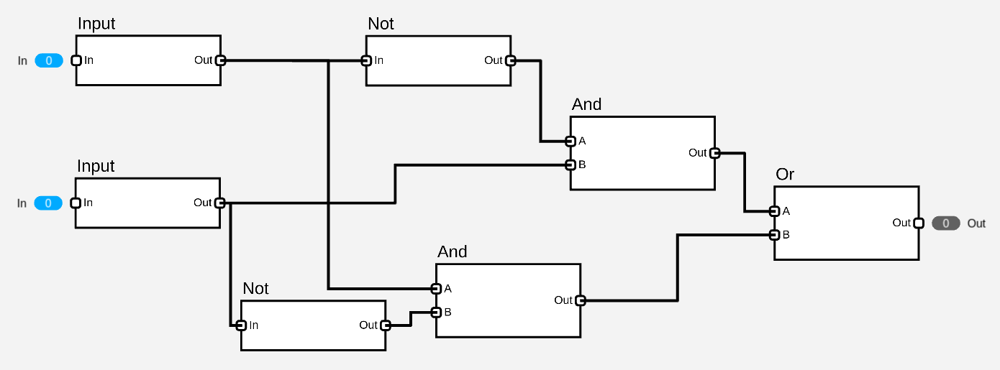

