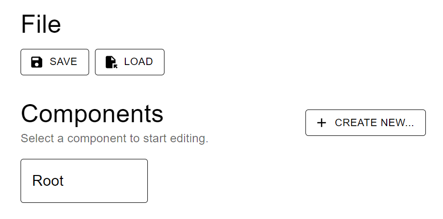
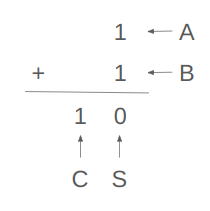
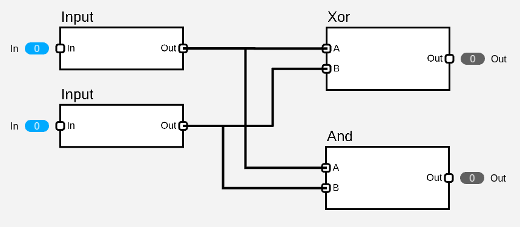

# 半加算器
それでは、次に半加算器を作っていきましょう。半加算器はコンポーネントにします。写真のXボタンを押してください。

そしてこの画面でコンポーネントの名前をHalfAdderとして、Create!ボタンを押しましょう。

これで、作った半加算器が他のコンポーネントで使えるようになります。

半加算器は次のような動作をする回路です。

| A | B | C | S |
| - | - | - | - |
| 0 | 0 | 0 | 0 |
| 0 | 1 | 0 | 1 |
| 1 | 0 | 0 | 1 |
| 1 | 1 | 1 | 0 |

A,Bが入力、S,Cが出力です。SはAが0かつBが1の時、またはAが1かつBが0の時に1になります。CはAが1かつBが1の時にSが1となります。これは、次のような筆算を思い浮かべれば足し算をしていることが分かるでしょう。

| A | B | C |
| - | - | - |
| 0 | 0 | 0 |
| 0 | 1 | 0 |
| 1 | 0 | 0 |
| 1 | 1 | 1 |

ここで、出力Cのみに注目してみると、これはAnd回路と同じです。

| A | B | S |
| - | - | - |
| 0 | 0 | 0 |
| 0 | 1 | 1 |
| 1 | 0 | 1 |
| 1 | 1 | 0 |

同様に出力Sのみに注目してみると、これは基本の論理回路で見たXor回路と同じですね。

以上より、実際の回路は次のようになります。

