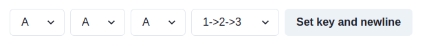

# エニグマ
## エニグマの使い方
まず、[エニグマ](https://kf74-code.pages.dev/)を開いてください。

<a href="https://kf74-code.pages.dev/" target="_blank" rel="noreferrer" className="button button--primary button--block">エニグマを体験できるサイトを開く</a>

これは、エニグマの鍵を設定する部分です。エニグマは、スクランブラーの初期状態と順番が鍵となっています。この画像では、3つのスクランブラーの初期状態はすべてAで、その順番は1, 2, 3となっています。鍵を変更したい場合は、鍵を設定して、Set key and newlineボタンを押します。

それでは、HELLOと打ってみましょう。鍵が画像と同様であれば、GGJQZと表示されるはずです。

次に、Set key and newlineボタンを押して、HELLOと打った時に表示された文字列を入力してみましょう。すると、もとの文章であるHELLOが表示されるはずです。

これがエニグマの特徴で、鍵が同じであれば、暗号文をもう一度暗号化するともとの文章に戻ります。これによって、鍵を知っていれば暗号を復号するのが容易となっています。どのような仕組みでこの機能が実現されているのでしょうか？

## エニグマの仕組み
エニグマには、3つ(またはそれ以上)のスクランブラーと呼ばれる、ある文字を別の文字に置き換える部品があります。このような文字を入れ替える暗号としては、毎回決まった文字だけずらすシーザー暗号が有名ですが、シーザー暗号は、文章中に現れる文字の出現頻度によって鍵を容易に予測することが出来てしまいます。そのため、エニグマでは、一文字暗号化するごとに、スクランブラーに取り付けられているローターが一文字分回転し、別の文字に置換されるようになります。

アルファベットは26文字あるので、スクランブラーが一つの場合は26文字で一周することとなります。1つ目のスクランブラーが一周すると、2つ目のスクランブラーのローターが一文字回転します。同様に、2つ目のスクランブラーが一周すると、3つ目のスクランブラーのローターが一文字分回転します。つまり、3つスクランブラーがある場合、26の3乗=17576文字で一周することとなります。鍵は、このスクランブラーの初期状態に加えて、スクランブラーをどの順番で配置するかの6通りがあるので、鍵の状態は105456通りあります。

文字は、3つのスクランブラーで置換された後に、リフレクターという部品に入ります。リフレクターは、２つの文字を入れ替える置換をします。例えば、AがQに変換されるとすると、QはAに変換されます。このリフレクターを通った後に、今度はスクランブラーに最初に入力した方向と逆の方向から文字を入力します。最初に1, 2, 3の順番でスクランブラーを通ったとすると、今度は3, 2, 1の順番でスクランブラーの逆側から文字が入力されることとなります。

これによって、鍵の初期状態が一緒であれば、ある文字が別の文字に置換された時、その置換された文字はもとの文字に置換されることになります。例えば、AがQに暗号化された場合、QはAに暗号化されます。これによって、暗号文を再び入力するともとの文章が得られます。

それでは、家族や友人に、暗号文と鍵を伝えて、秘密のメッセージを伝えてみましょう！
