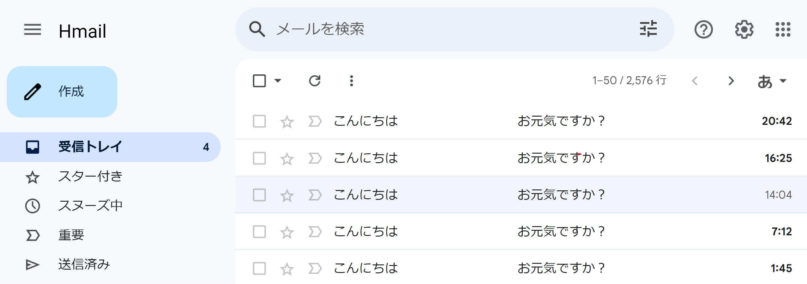

# データベースからデータを盗み出そう

近年では Gmail や Outlook.com といった Web メールがよく用いられています。
通常メールのやり取りの中には膨大な個人情報が含まれており、ハッカーにとっては美味しい標的です。
ハッカーになった気持ちで、セキュリティ上の欠陥がある Web メールサービスから他人のメールを盗み出してみましょう。



## Web サーバーとデータベース

Web サービスは様々な要素で構成されていますが、通常はあなたの端末（パソコンやスマホなど）と直接通信する **Web サーバー**と、データを保存しておく**データベース**を持っています。
Web サーバーはあなたの要求に合わせ、データベースから必要なデータを取り出し、あなたのために表示します。

さて、このメールサービスには検索機能がついており、あなたは友人の `Aさん` からのメールを検索したとしましょう。
あなたの端末は、まず Web サーバーに「`Aさん` からのメールが見たいです」と要求します。

すると、Web サーバーは、データベースに対して必要なデータを問い合わせます。このやりとりは、**SQL** と呼ばれる言葉を介して行われます。

SQL はプログラミング言語のようなものなので、Web サービスを作るプログラマが事前に用意しておかなければなりません。
しかし、この例のような検索機能では、データベースに問い合わせを行う際の条件はあなたの操作に応じて変わるので、データベースの問い合わせに用いる SQL もその条件に応じて変わります。
そこで、Web サービスのプログラマは、SQL の雛型のみを用意し、その雛型にあなたが指定した条件を埋め込みます。

例えば、プログラマが用意した SQL の雛型が

```
差出人＝「⭐️」かつ受取人＝「🌙」であるようなメールを取得
```

のようなものであったとしましょう。
あなたが `Aさん` からのメールが欲しいと Web サーバーに要求すれば、Web サーバーはこの雛型の `⭐️` を `Aさん` に、`🌙` を `あなた` に置き換えます。
これにより最終的にデータベースに対して送られる SQL は

```
差出人＝「Aさん」かつ受取人＝「あなた」であるようなメールを取得
```

になるのです。



:::tip 受取人の条件はなぜ必要なの？
上の例では、あなたは Web サーバーに対し、差出人に関する条件のみを指定する想定をしましたが、Web サーバーが生成する SQL の中には、差出人だけでなく受取人の条件も含まれていました。
これはなぜでしょうか。

実は、通常データベースには、誰のデータであるかにかかわらず、同じ種類のデータは同じ場所に保存しておきます。
データの持ち主が誰であるかは、そのデータ自体に記録します。
今回であれば、メールが持つ「受取人」という属性が、データの所有者を表現しています。
このようにすることで、データをより柔軟に取り扱うことができるようになるためです。

Web サーバーは Web サービスのプログラマが作るため、データベースに保存されている全ての情報を閲覧・編集できますが、Web サービスの使用者が見ても良いのは自分が持っているデータだけです。
このため、Web サーバーは、データベースに問い合わせを行う際、Web サービスの使用者に見せてはいけない情報を隠す責任を負っているのです。
:::

## 悪意のある要求

`Aさん` があなたに送ったメールは、当然あなたしか閲覧できないはずです。
しかし、不届き者のハッカー、`Xさん` がこのメールを盗み見ようとしていました。

前項でお話ししたように、Web サーバーがデータベースに問い合わせを行う際、Web サーバーは検索条件に Web サービスの使用者が受取人と一致するという条件を加えます。
このため、`Xさん` が見られるのは受取人が `Xさん` であるようなメールだけであるはずです。
しかし、このサービスには欠陥があるため、`Xさん` はこの制限を掻い潜って他の人のメールを覗き見ることができてしまいます。

`Xさん` は何をしたのでしょうか。
答えはそこまで複雑ではありません。
`Xさん` は、検索条件として `「」` (かぎかっこ) を含むような文字列を指定したのです。
具体的には、「`Aさん」または差出人＝「Aさん` からのメールが見たいです」のように Web サーバーに要求します。

すると、先ほどと同じように、Web サーバーは雛型の `⭐️` を `Aさん」または差出人＝「Aさん` に、`🌙` を `Xさん` に置き換えます。
これにより最終的にデータベースに対して送られる SQL は

```
差出人＝「Aさん」または差出人＝「Aさん」かつ受取人＝「Xさん」であるようなメールを取得
```

のようになります。



SQL では、通常「かつ」は「または」より優先されます。
ですので、`差出人＝「Aさん」または差出人＝「Aさん」かつ受取人＝「Xさん」` という条件は、

1. `差出人＝「Aさん」`
2. `差出人＝「Aさん」かつ受取人＝「Xさん」`

の条件のいずれかが満たされたときに満たされます。
2 の条件が満たされれば 1 の条件は常に満たされますので、この 2 つの条件は実質的に `差出人＝「Aさん」` のみしか指定できていません。
したがって、`Xさん` は `Aさん` が送ったメールを全て盗み見ることができてしまうのです。
このような攻撃手法を、**SQL インジェクション**と呼びます。

:::tip 脆弱性
アプリケーションがあるセキュリティ上の課題を持つ場合、そのアプリケーションは**脆弱**であるといいます。
また、この課題を**脆弱性**と呼びます。
:::

## SQL インジェクションの実践

あなたはG国という国で有名なハッカーです。ある日、G国付近にあり、隣国のI国の領土である銀杏島にて、レアアース泥が発見されました。G国の政府は銀杏島のレアアース獲得を目指しています。あなたは、G国政府に、I国内のメールのやり取りから、島の警備情報を盗み見ることを命じられました。
下のリンクをクリックして、SQL インジェクションの脆弱性を持つメールサービスからデータを盗み出してみましょう。

<p><a href="https://try-sql-injection.onrender.com/" target="_blank" rel="noreferrer" className="button button--primary button--block">SQL インジェクションの脆弱性を持つメールサービスを開く</a></p>

SQL によりデータを取得するには、SELECT 文を用います。
事前情報により、このメールサービスでは、SQL の雛型として、次のような SELECT 文を用いていることが分かっています。

```sql
SELECT * FROM "Mail" WHERE "from" = '⭐️' AND "to" = 'あなた';
```

メールサイト上部にある入力欄に入力された内容が上の⭐️に代入されます。例えば、入力欄に Aさん と入力すると
```sql
SELECT * FROM "Mail" WHERE "from" = 'Aさん' AND "to" = 'あなた';
```
というSQL文になります。これによって、『送信者』が「Aさん」かつ『宛先』が「あなた」のメールを検索できます。

SELECT 文は、次のような構文を持ちます。


```sql
SELECT 取得する属性名 FROM データの種類 WHERE 条件
```

この例では、データの種類として `Mail` (メールのデータ)、取得する属性として `*` (メールが持つ全ての属性) を指定しています。

条件は、次のような書式で設定できます。属性名は `"` (ダブルクォーテーション)、値は `'` (シングルクォーテーション) で囲まれていることに注意してください。
`AND` は「かつ」、`OR` は「または」を表しています。

```sql
"属性名" = '値' ANDまたはOR "属性名" = '値' ANDまたはOR ...
```

メールが持つ属性は

- `from`: 差出人の名前
- `toType`: toかccかbccか
- `to`: 受取人の名前
- `date`: 送信日時
- `subject`: メールの件名
- `content`: メールの本文

の 6 つであることが分かっています。

<details>
   <summary>課題のヒント</summary>
   <div>
      入力欄に `Aさん' OR "from"='Aさん`と入力すると、
      ```sql
      SELECT * FROM "Mail" WHERE "from" = '⭐️' AND "to" = 'あなた';
      ```
      の⭐️に、入力内容が代入されるので、
      データベースに送信されるSQL文は
      ```sql
      SELECT * FROM "Mail" WHERE "from" = 'Aさん' OR "from"='Aさん' AND "to" = 'あなた';
      ```
      となり、Aさんが送信したメールをすべて抽出することができます。
      ⭐️が`Aさん' OR "from"='Aさん`に置き換わることで、全体としての意味が大きく変化していることに注目してください。
   </div>
</details>