# ほかのユーザーを妨害しよう

Web サービスに対する攻撃は、データベースの中を覗こうとするものに限りません。
XSS は、Web が動作する仕組みを巧妙に悪用し、同じ Web サービスを使う別のユーザーに攻撃する手法です。

## ブラウザと HTML・JavaScript

パソコンやスマートフォンを用い、インターネットで調べ物をしているとき、あなたは何というアプリを使っていますか？
iPhone を使っている方は Safari を、Android を使っている方は Google Chrome を、Windows を使っている方は Microsoft Edge を使うことが多いのではないでしょうか。

Safari や Google Chrome のように、ウェブサイトを見るためのソフトウェアを**ブラウザ**と呼びます。
どのブラウザを使っても同じようにウェブサイトが動作するのは、このブラウザと呼ばれるソフトウェアの動作が、国際機関によって標準化されているためです。

これまでに見てきたように、あなたがウェブサイトを見ようとしたとき、ブラウザはあなたの意思に応えて Web サーバーにウェブサイトのデータを送るよう要求します。

このとき、Web サーバーがブラウザに対して送り返すデータは、**HTML** や **JavaScript** といったプログラミング言語で記述されています。
この HTML や JavaScript をブラウザが解釈して実行することにより、ウェブサイトは動作しているのです。

