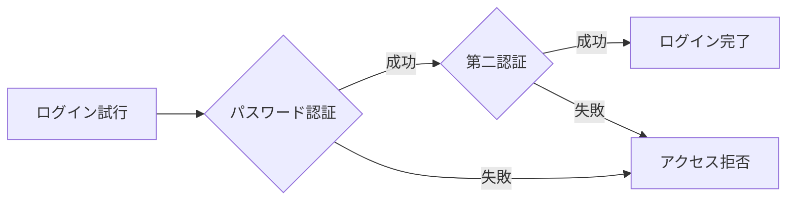

# パスワードセキュリティの重要性

## なぜセキュリティが重要か

- 個人情報の保護
- なりすまし被害の防止
- 金銭的損失の回避
- プライバシーの確保

## 強力なパスワードの必須要素

### 1. 長さ

最低12文字以上を推奨しています。パスワードが長くなればなるほど、解読が困難になります。

### 2. 文字の組み合わせ

強力なパスワードには以下の要素を含める必要があります：

- 大文字（A-Z）
- 小文字（a-z）
- 数字（0-9）
- 特殊文字（!@#$%^&\*など）

```js
// 強力なパスワードの例
const strongPassword = "Tr@ff1c_L1ght_2024!";
```

## 避けるべき事項

以下の要素は使用を避けてください：

- 誕生日や電話番号などの個人情報
- 連続した数字（123456など）
- 一般的な単語
- 複数のアカウントで同じパスワードの使い回し

## 追加のセキュリティ対策

さらなるセキュリティ向上のために：

1. **二要素認証の利用**

   - SMS認証
   - アプリ認証
   - 生体認証

2. **パスワード管理ソフトの使用**

   - 安全な保存
   - 自動生成機能
   - 暗号化

3. **定期的なパスワード変更**
   - 3-6ヶ月ごとの更新
   - 過去のパスワードの再利用を避ける

# 二要素認証（2FA）完全ガイド

## 二要素認証とは

二要素認証は、以下の3つのカテゴリーから2つ以上を組み合わせてアカウントを保護する方法です：

1. **知っているもの**

   - パスワード
   - PINコード
   - 秘密の質問

2. **持っているもの**

   - スマートフォン
   - セキュリティキー
   - ICカード

3. **あなた自身の特徴**
   - 指紋
   - 顔認証
   - 虹彩

## なぜ二要素認証が重要なのか

### 1. パスワード漏洩への対策

パスワードが漏洩しても、第二の認証要素があるため、不正アクセスを防ぐことができます。



### 2. セキュリティの大幅な向上

- 不正アクセスのリスクを**99%以上削減**できるというデータもあります
- ブルートフォース攻撃への耐性が格段に向上
- フィッシング詐欺対策としても有効

### 3. コンプライアンス対応

多くの業界標準やセキュリティ規制で二要素認証の実装が求められています。

## 主な二要素認証の方式

### 1. SMS認証

- **メリット**：導入が容易
- **デメリット**：SIMスワップ攻撃のリスク

### 2. 認証アプリ

- **メリット**：高いセキュリティ、オフライン利用可
- **デメリット**：初期設定の手間

### 3. セキュリティキー

- **メリット**：最も安全な方式
- **デメリット**：追加のハードウェアが必要

## ベストプラクティス

1. **重要なアカウントでの必須化**

   - オンラインバンキング
   - メールアカウント
   - クラウドストレージ

2. **バックアップ手段の確保**

   - リカバリーコードの保管
   - 代替の認証デバイスの登録

3. **定期的な見直し**
   - 認証方式の評価
   - セキュリティ設定の確認

## よくある質問

### Q: 二要素認証は面倒ではないですか？

A: 初期設定に若干の手間はかかりますが、それ以上のセキュリティメリットがあります。

### Q: スマートフォンを失くしたらどうすればよいですか？

A: バックアップコードを使用するか、事前に登録した代替の認証方法を利用します。
