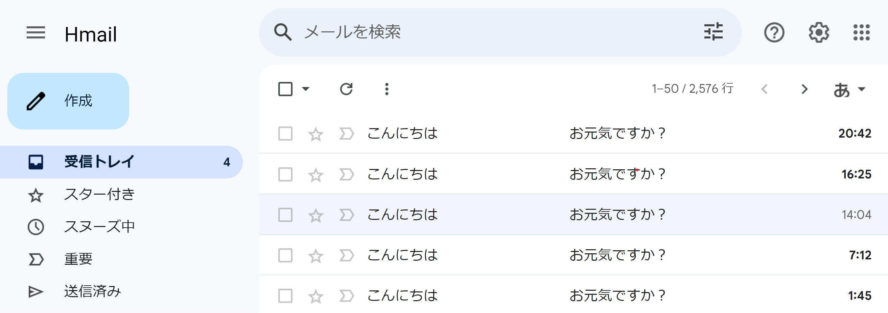
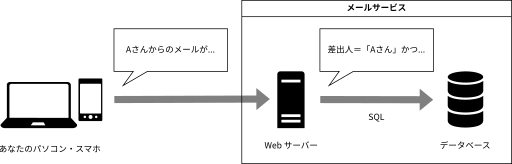

import { LinkButton } from "@astrojs/starlight/components";

# データベースからデータを盗み出そう

メールのやり取りの中には膨大な個人情報が含まれており、ハッカーにとっては美味しい標的です。
ハッカーになった気持ちで、セキュリティ上の欠陥がある Web メールサービスから他人のメールを盗み出してみましょう。



## Web メールの仕組み

- Webサーバー: みんなのパソコンやスマホと通信して、必要なデータを探す役割。

- データベース: メールの情報などを保存している場所。

例えば、友だちの「Aさん」からのメールを見たいとき、君のパソコンはWebサーバーに「Aさんからのメールを見せて！」と頼みます。

Webサーバーは、データベースに対して「差出人がAさんで受取人が君のメールをください」と問い合わせます。
この問い合わせの言葉を SQL（エスキューエル） と言います。

## SQLのひな形（テンプレート）

Webサービスを作る人は、SQLのひな形を用意しておき、君が入力した条件をその中に入れます。

例えば、

```sql
差出人 = '⭐️' かつ 受取人 = '君' であるようなメールを取得
```

この⭐️のところに「Aさん」が入ると、

```sql
差出人 = 'Aさん' かつ 受取人 = '君' であるようなメールを取得
```

となり、Aさんから君宛のメールが検索されます。



## 悪意のある要求

`Aさん` があなたに送ったメールは、当然あなたしか閲覧できないはずです。
しかし、不届き者のハッカー、`Xさん` がこのメールを盗み見ようとしていました。

メールサービスがデータベースに問い合わせを行う際、使用者が受取人と一致するという条件を加えます。
しかし、このサービスには欠陥があるため、`Xさん` はこの制限を掻い潜って他の人のメールを覗き見ることができてしまいます。

`Xさん` は、検索条件として `「」` (かぎかっこ) を含むような文字列を指定したのです。
具体的には、「`Aさん」または差出人＝「Aさん` からのメールが見たいです」のように Web サーバーに要求します。

すると、先ほどと同じように、Web サーバーはひな型の `⭐️` を `Aさん」または差出人＝「Bさん` に置き換えます。

これにより最終的にデータベースに対して送られる SQL は

```
差出人＝「Aさん」または差出人＝「Bさん」かつ受取人＝「Xさん」であるようなメールを取得
```

のようになります。

SQL では、通常「かつ」は「または」より優先されるので、`差出人＝「Aさん」または差出人＝「Bさん」かつ受取人＝「Xさん」` という条件は、

1. `差出人＝「Aさん」`
2. `差出人＝「Bさん」かつ受取人＝「Xさん」`

の条件のいずれかが満たされたときに満たされます。

したがって、`Xさん` は `Aさん` が送ったメールを全て盗み見ることができてしまうのです。

このような攻撃手法を、**SQL インジェクション**と呼びます。

:::note[脆弱性]
アプリケーションがあるセキュリティ上の課題を持つ場合、そのアプリケーションは**脆弱**であるといいます。
また、この課題を**脆弱性**と呼びます。
:::

## SQL インジェクションの実践

> あなたはF国のプロ野球リーグの調査委員会のメンバーです。最近、F国のプロ野球リーグで八百長の疑惑が持ち上がり、リーグの試合結果が不正に 操作されている可能性があるとされています。あなたの任務は、この疑惑を解明し、関連する証拠を収集することです。調査の一環として、リーグ 関係者がやり取りするメールの内容を確認する必要があります。
>
> メールが持つ属性は
>
> - `from`: 差出人の名前
> - `toType`: toかccかbccか
> - `to`: 受取人の名前
> - `date`: 送信日時
> - `subject`: メールの件名
> - `content`: メールの本文
>
> の 6 つであることが分かっています。

SQL によりデータを取得するには、SELECT 文を用います。
事前情報により、このメールサービスでは、SQL のひな型として、次のような SELECT 文を用いていることが分かっています。

```sql
SELECT * FROM "mails" WHERE "to" = 'あなた' AND "from" = '⭐️';
```

メールサイト上部にある入力欄に入力された内容が上の⭐️に代入されます。例えば、入力欄に Aさん と入力すると

```sql
SELECT * FROM "mails" WHERE "to" = 'あなた' AND "from" = 'Aさん';
```

というSQL文になります。これによって、『送信者』が「Aさん」かつ『宛先』が「あなた」のメールを検索できます。

属性名は `"` (ダブルクォーテーション)、値は `'` (シングルクォーテーション) で囲まれていることに注意してください。

<LinkButton
  href="/apps/practice-sql"
  target="_blank"
  icon="external"
  rel="noreferrer"
>
  メールサービスを開く
</LinkButton>

<details>
  <summary>解答例</summary>
  送信される SQL のひな型は、以下のようなものでしたね。

```sql
SELECT * FROM "mails" WHERE "to" = 'あなた' AND "from" = '⭐️';
```

この⭐️に文字を入れて作れるもののうち、すべてのメールで `WHERE` 節が正しくなるもののひとつに、以下のような SQL 文があります。

```sql
SELECT * FROM "mails" WHERE "to" = 'あなた' AND "from" = '' OR '1' = '1';
```

なので、 ⭐️には次の文字列を入れればいいですね。

```txt
' OR '1' = '1
```

先ほどのメールサービスをもう一度開いて、このテキストを入れてみましょう。

</details>
